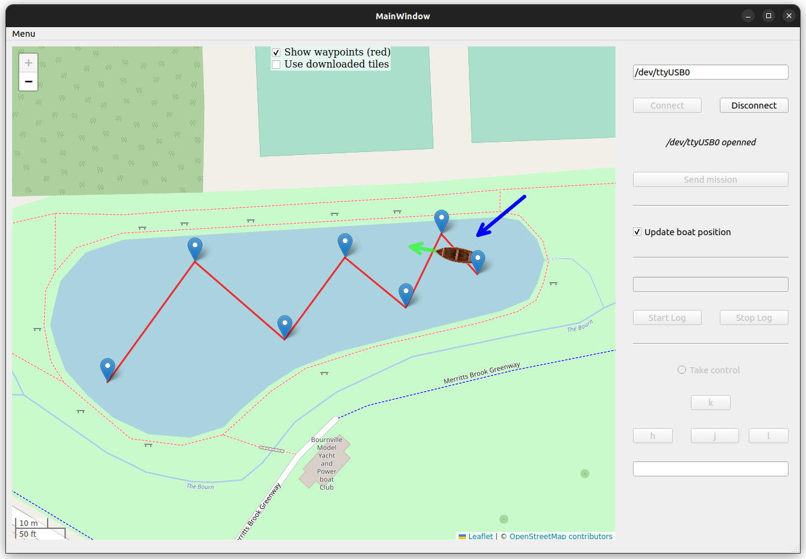

This repository includes all the files and instructions to monitor the sailboat.


# How it works

A website is used to display the boat position and orientation on a map. All the informations about the condition of the boat are stored in a database. The website retrieves the data it needs to plot the boat from this database. The database is updated thanks to a program that receives data from the xbee.

Thus in order to work you have to install a HTTP server (apache2) and a database (mysql). To do so please follow the instructions in INSTALLATION.md.

Once the webserver is installed you can use the user interface in UI/ folder. Make sur that the xbee is connected to your computer and the device name is correct. Here is an example:


**WARNING**: Don't forget to change your credential in the UI/main.py file lines 77 to 80.





# Upload a mission

You have to select a mission file.
Your mission file should look like this

```txt
lat1 lon1
lat2 lon2
lat3 lon3
lat4 lon4
lat5 lon5
```

See example_mission.txt for a real example

# Log

You can start the log in the UI.
The name of the logging file will be displayed when started.
The number of written lines will be displayed when closed


# Take control

You can take control of the boat by using the the four button:
- 'h' : turn rudder to the left
- 'j' : close the sail
- 'k' : open the sail
- 'l' : turn rudder to the right
